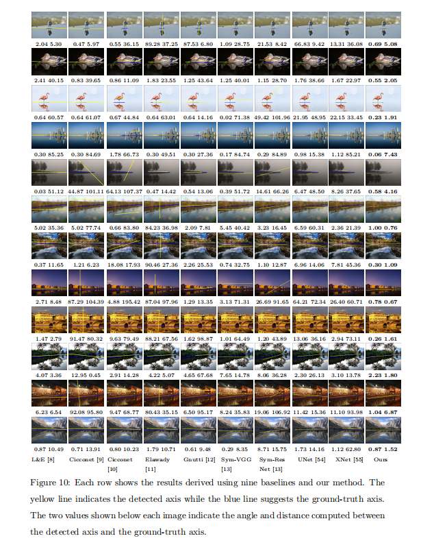
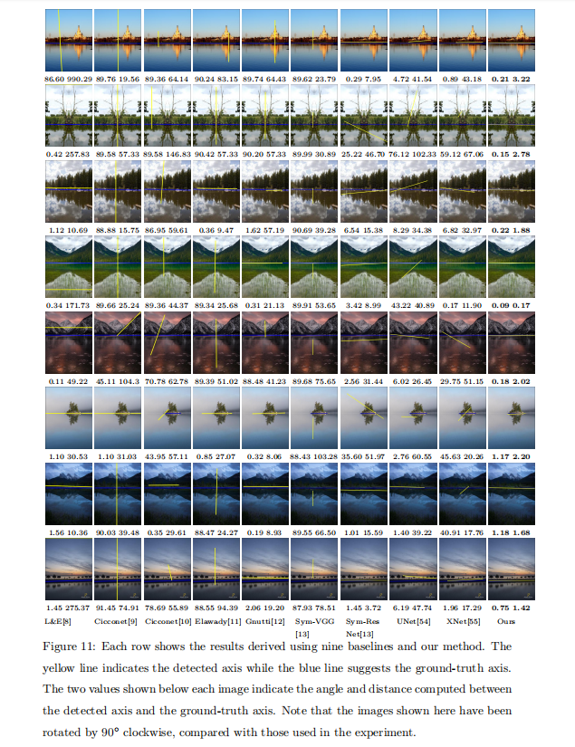

<p align="center"> 
<a href="" ></a>
<a href="https://indtlab.github.io/projects/WRD-Net" ></a>
<a href="" ></a>
<a href="https://indtlab.github.io/projects/WRD-Net" ></a>
</p>

# Architecture


# Usage
### Installation
1. Create the environment from the `environment.yaml` file:   
   ```copy
   conda env create -f environment.yaml
   ```     
2. Activate the new environment:  
   ```copy
   conda activate base
   ```    
3. Verify that the new environment was installed correctly:  
    ```copy
   conda env list
    ```    

### Configuration

### Data Sets
Download Water Reflection Scene Data Set(WRSD) : <a href="https://drive.google.com/file/d/1D00quOYefmW_VoBnJVNjkezOa2w-aUWl/view?usp=drive_link">GoogleLink</a> or <a href="https://pan.baidu.com/s/1G8E_m03HXL2M6IszvoDLUw?pwd=6bmg ">BaiduLink</a> with code `6bmg`      

### Train and Test
You can use command like this:  
```copy
python train.py
```
You can also download th pre-trained models on the WRSD: <a href="https://drive.google.com/file/d/1FCx4BShJsBLxDu9w4kwTBjKjdXWMFgNb/view?usp=drive_link">GoogleLink</a> or <a href="https://pan.baidu.com/s/1ZOg3o7DXqRnzMVOf6WQuEQ?pwd=adzl ">BaiduLink</a>  with code adzl, and then use command like this:  
```copy
python test.py
```

### Calculate TP Rate
You can run evaluate.ipynb in Jupyter Notebook to calculate the TP Rate.


# Results

<div align=center></div>  
<div align=center></div>  

# Citation
```
@article{dong2024wrd,
  title={WRD-Net: Water Reflection Detection using a parallel attention transformer},
  author={Dong, Huijie and Qi, Hao and Zhou, Huiyu and Dong, Junyu and Dong, Xinghui},
  journal={Pattern Recognition},
  pages={110467},
  year={2024},
  publisher={Elsevier}
}
```
